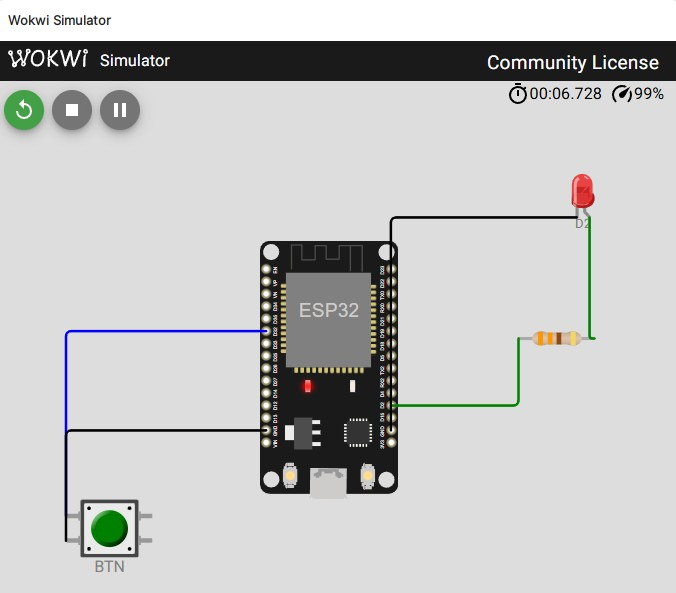

# Stufe 4 — ESP32 Einstieg

**Ziel:** Den ESP32 in Betrieb nehmen und mit GPIOs arbeiten.
**Was du lernst:** Arduino-IDE einrichten, Board-Support, `setup()` / `loop()`, `pinMode`, `digitalWrite`, `digitalRead`, Serial Monitor.
**Voraussetzung:** keine ESP32-Vorkenntnisse
**Dauer:** ca. 30 Minuten (davon ~10 Min. für die erstmalige Toolchain-Installation)

## Was bauen wir?

In dieser Stufe schreibst du deine ersten **zwei kleinen Programme** für den ESP32:

1. **Blink** — ein 1-Hz-Rechteck auf der Onboard-LED. Entspricht funktional dem astabilen TLC555 aus Stufe 1, nur eben in Software.
2. **Button** — ein Taster steuert die LED und gibt bei jedem Druck etwas auf den Serial Monitor aus.

Es fließt noch **kein Strom in Richtung 555**. Wir üben nur das ESP32-Werkzeug ein, damit wir ab Stufe 5 den 555 mit dem Mikrocontroller verheiraten können.

## Hardware-Überblick (ESP32-DevKit V1)

Das Board um den ESP32-WROOM-32 hat:

- **USB-Buchse** (Micro-USB) mit integriertem USB-Seriell-Wandler (meist CP2102 oder CH340).
- **3,3-V- und 5-V-Schiene.** Der ESP32 selbst läuft bei 3,3 V — **GPIOs sind nicht 5-V-tolerant**. Für uns unkritisch, weil der TLC555 mit 3,3 V läuft.
- **Zwei Taster:** `EN` (Reset) und `BOOT` (GPIO 0 auf GND halten → Flash-Modus beim Reset).
- **38 GPIO-Pins** — aber nur ein Teil davon ist „frei" nutzbar.

### Pin-Klassen (Merkzettel)

| Pin | Besonderheit |
|-----|--------------|
| GPIO 0, 2, 12, 15 | **Strapping-Pins** — werden beim Boot ausgelesen. Als Ausgang ok, als Eingang Vorsicht. |
| GPIO 6–11 | intern mit dem Flash-Chip verbunden — **nicht** benutzen. |
| GPIO 34, 35, 36, 39 | **nur Eingang**, kein Pull-up/down, kein Output. |
| GPIO 1, 3 | UART0 (Serial Monitor) — nur benutzen, wenn kein Debug-Output. |
| Alle anderen | frei, bis 40 mA Ausgangsstrom pro Pin. |

Für unsere Zwecke frei und bequem: **GPIO 13, 14, 18, 19, 21, 22, 23, 25, 26, 27, 32, 33**.

## Toolchain einrichten

> **Kein ESP32 zur Hand?** Die Sketches ab dieser Stufe lassen sich statt auf echter Hardware auch im **Wokwi-Simulator** ausführen. Setup-Anleitung: [Anhang — Wokwi einrichten](anhang-wokwi.md). Der Hauptweg bleibt aber der reale Aufbau — am Steckbrett siehst du Effekte, die kein Simulator reproduziert.

### Arduino IDE installieren

1. [arduino.cc/en/software](https://www.arduino.cc/en/software) → „Arduino IDE 2.x" für Windows herunterladen, installieren.

### ESP32-Board-Support hinzufügen

1. **Datei → Einstellungen → Zusätzliche Boardverwalter-URLs:**
   ```
   https://raw.githubusercontent.com/espressif/arduino-esp32/gh-pages/package_esp32_index.json
   ```
2. **Werkzeuge → Board → Boardverwalter …** → nach „esp32" suchen → „esp32 by Espressif Systems" installieren.

### Treiber für den USB-Seriell-Wandler

- **CP2102-Boards:** Treiber von Silicon Labs.
- **CH340/CH341-Boards:** Treiber von WCH.

Unter Windows 11 werden beide meist automatisch nachgeladen. Prüfen im Geräte-Manager: wenn am USB-Kabel ein „COMx" auftaucht, passt es.

### Board und Port auswählen

- **Werkzeuge → Board → esp32 → „ESP32 Dev Module"** (oder den konkreten Namen deines Boards).
- **Werkzeuge → Port → COMx**.
- **Upload Speed:** 921600 (Default) funktioniert meist; bei Problemen auf 115200 zurückschalten.

## Erste Sketches

### Sketch 1 — Blink

Die Onboard-LED des DevKit V1 sitzt an **GPIO 2**. Damit lässt sich Blink ohne zusätzliche Hardware testen.

Code: [`code/stage04_blink/stage04_blink.ino`](../code/stage04_blink/stage04_blink.ino)

```cpp
const uint8_t LED_PIN = 2;

void setup() {
  pinMode(LED_PIN, OUTPUT);
}

void loop() {
  digitalWrite(LED_PIN, HIGH);
  delay(500);
  digitalWrite(LED_PIN, LOW);
  delay(500);
}
```

Kompilieren (Häkchen-Symbol), hochladen (Pfeil-Symbol). Beim Upload kurz warten — der ESP32 wird automatisch in den Flash-Modus geschickt. Manche Boards brauchen manuelles Drücken der BOOT-Taste, wenn der Upload stecken bleibt.

> **Checkpoint:** Die rote Power-LED am Board brennt dauerhaft. Die blaue Onboard-LED (GPIO 2) blinkt im Sekundentakt. Wenn ja: Toolchain läuft.

**Rückbezug zu Stufe 1:** Das ist ein 1-Hz-Blink in Software. Er macht funktional dasselbe wie der astabile TLC555 — nur dass die Frequenz jetzt vom Quarz des ESP32 stammt (genauer) und wir sie per Code beliebig ändern können.


### Sketch 2 — Taster lesen

Taster zwischen **GPIO 32** und GND; der interne Pull-up schaltet auf HIGH, Druck zieht auf LOW. LED auf GPIO 2 spiegelt den Tastendruck, Serial Monitor meldet jede fallende Flanke.

Code: [`code/stage04_button/stage04_button.ino`](../code/stage04_button/stage04_button.ino)

Serial Monitor öffnen (Lupen-Symbol), Baudrate auf **115200** setzen.

> **Checkpoint:** Taster drücken → Onboard-LED geht an, Serial Monitor zeigt „Button pressed". Loslassen → LED aus, keine neue Meldung.



### Rückbezug auf Hardware-555

Schließe versuchsweise den **Pin 3 des TLC555 aus Stufe 1** (über eine kurze Steckbrücke; gemeinsame Masse mit dem ESP32) an **GPIO 32** an — dann siehst du auf der Onboard-LED den 555-Takt. Der ESP32 spielt Oszilloskop. Das ist die inhaltliche Brücke zu [Stufe 5](05-esp32-beobachtet.md).

## Häufige Startschwierigkeiten

| Symptom | Ursache / Abhilfe |
|---------|-------------------|
| Port taucht nicht auf | USB-Kabel ist Lade-only → Datenkabel nehmen. Oder Treiber fehlt. |
| „A fatal error occurred: Failed to connect" beim Upload | BOOT-Taste gedrückt halten, während der Upload startet, dann loslassen. |
| Sketch läuft nicht nach Upload | EN-Taste drücken (Reset), oder kurz Strom trennen. |
| Serial Monitor zeigt nur Buchstabensalat | Baudrate prüfen (115200). |
| Board hängt beim Boot, GPIO 2 leuchtet schwach | Strapping-Pin GPIO 2 ist beim Boot als Ausgang LOW gezogen worden — ok, nur kosmetisch. |

## Rückblick

Was du jetzt kannst:

- Einen **ESP32 flashen** (Board-Support installiert, Port gewählt, Sketch hochgeladen).
- Einen **GPIO als Ausgang** schalten (`pinMode(OUTPUT)` + `digitalWrite`).
- Einen **GPIO als Eingang** mit internem Pull-up lesen (`INPUT_PULLUP` + `digitalRead`).
- Über **Serial** mit dem Board kommunizieren.
- Die wichtigsten **Pin-Klassen** des ESP32 unterscheiden (frei vs. Strapping vs. Input-only vs. Flash-reserviert).

## Übergang zur nächsten Stufe

Der ESP32 läuft und reagiert auf Eingaben. In [Stufe 5](05-esp32-beobachtet.md) lassen wir ihn den Takt des TLC555 **beobachten** und die Frequenz am Serial Monitor anzeigen — messen vor steuern.
