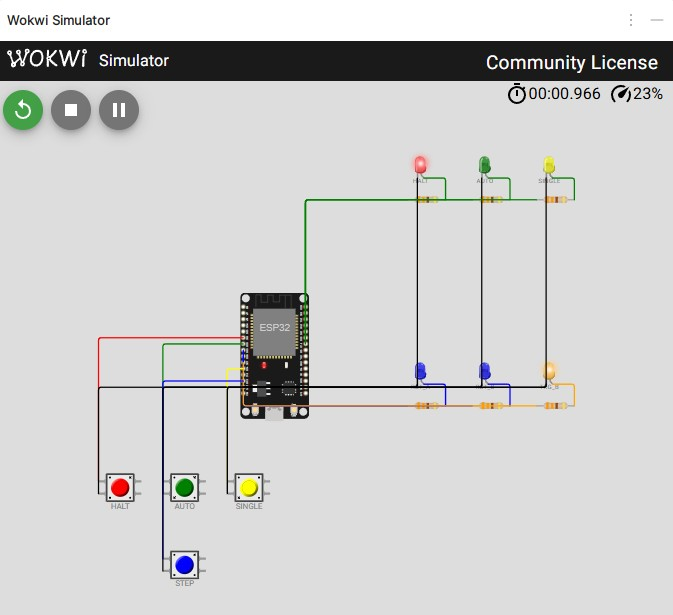

# Stufe 6 — ESP32 steuert den Taktgenerator (Zielstufe)

**Ziel:** Die drei Modi `auto` / `single` / `halt` per ESP32 umschalten — das Kernziel des Tutorials.
**Was du lernst:** State-Machine in C++, Tasterentprellung per `millis()`, Reset-Pin-Steuerung von außen, sauberes Triggern des Monostabilen.
**Voraussetzung:** [Stufe 2](02-monostabil.md), [Stufe 3](03-halt-reset.md), [Stufe 4](04-esp32-einstieg.md) (empfohlen zusätzlich [Stufe 5](05-esp32-beobachtet.md))
**Dauer:** ca. 60–90 Minuten

## Was bauen wir?

Die **Zielstufe des Tutorials.** Der Hardware-Taktgenerator aus Stufe 3 bleibt im Prinzip so, wie er ist — nur statt des Dreh- oder Kippschalters steuert ihn jetzt der ESP32. Vier kleine Taster wählen den Modus (`halt` / `auto` / `single` / `step`), drei Status-LEDs zeigen den aktuellen Modus. Im Serial Monitor siehst du jeden Moduswechsel.

Funktional ändert sich wenig gegenüber Stufe 3 — aber du hast jetzt die Grundlage für alles, was in Stufe 7 möglich wird: Display, Poti, Web-UI, Automatisierung.

## Konzept

Der Hardware-Aufbau ist identisch zu **Stufe 3** (555 A astabil + 555 B monostabil + Dioden-OR am Ausgang). Wir entfernen nur:

- den **SP3T-Mode-Schalter**,
- den **Step-Taster** an Pin 2 von 555 B,
- die 100-kΩ-Pull-downs an den RESET-Pins (der ESP32 treibt die Pegel aktiv).

An deren Stelle tritt der ESP32 mit drei Ausgängen (RESET_A, RESET_B, TRIG_B) und vier Eingängen (drei Mode-Taster + Step-Taster).

### Pin-Zuordnung

| ESP32-Pin | Richtung | Funktion |
|-----------|----------|----------|
| GPIO 25 | OUTPUT | → 555 A Pin 4 (RESET_A) |
| GPIO 26 | OUTPUT | → 555 B Pin 4 (RESET_B) |
| GPIO 27 | OUTPUT, idle HIGH | → 555 B Pin 2 (TRIG_B) |
| GPIO 32 | INPUT_PULLUP | ← Taster `MODE_HALT` |
| GPIO 33 | INPUT_PULLUP | ← Taster `MODE_AUTO` |
| GPIO 14 | INPUT_PULLUP | ← Taster `MODE_SINGLE` |
| GPIO 13 | INPUT_PULLUP | ← Taster `STEP` |
| GPIO 18 | OUTPUT | → LED `HALT` + 330 Ω |
| GPIO 19 | OUTPUT | → LED `AUTO` + 330 Ω |
| GPIO 21 | OUTPUT | → LED `SINGLE` + 330 Ω |

**Gemeinsame Masse** zwischen ESP32 und 555-Versorgung ist zwingend.

### Wahrheitstabelle für die Ausgänge

| Mode | RESET_A | RESET_B | TRIG_B |
|------|---------|---------|--------|
| HALT   | LOW  | LOW  | HIGH (idle) |
| AUTO   | HIGH | LOW  | HIGH (idle) |
| SINGLE | LOW  | HIGH | HIGH, pulsiert auf LOW bei Step |

## Schaltung

Nimm die Schaltung aus Stufe 3 und ersetze:

- **Mode-Schalter** → drei Leitungen vom ESP32 (RESET_A, RESET_B) und vier Tastern zum ESP32.
- **Step-Taster am 555 B Pin 2** → Leitung vom ESP32 GPIO 27 an 555 B Pin 2. Der vorhandene 10-kΩ-Pull-up an Pin 2 kann **bleiben** — der ESP32 treibt im Idle HIGH, also gibt es keinen Konflikt. Alternativ kann er entfallen.

> **Warum nicht kapazitiv koppeln?** Wir könnten TRIG_B per 10 nF AC-koppeln, um ganz unabhängig von der Pegel-Haltezeit zu sein. Mit einem definierten LOW-Puls aus der Software brauchen wir das aber nicht — einfacher ist einfacher.

### Optional: Frequenzmessung aus Stufe 5 parallel

Gemeinsamer OUT-Knoten (nach den beiden Dioden) zusätzlich an **GPIO 34** des ESP32 — so zeigt der Serial Monitor die Frequenz des Takts, den er selbst steuert. Schönes Selbst-Beobachtungs-Experiment.

## Software

Vollständig in [`code/stage06_controller/stage06_controller.ino`](../code/stage06_controller/stage06_controller.ino).

### Aufbau

1. **Pin-Konstanten** als `constexpr uint8_t` — keine Makros.
2. **`enum Mode`** und globales `currentMode`.
3. **Button-Struktur** mit Entprellung per `millis()` — `detectPressEdge()` liefert genau beim Drücken einmal `true`.
4. **`applyMode(Mode)`** setzt die beiden RESET-Pins und die Status-LEDs passend zur Tabelle oben.
5. **`triggerStep()`** erzeugt einen LOW-Puls an TRIG_B (Länge: `TRIG_PULSE_MS`, Default 150 ms — der 555 B-Trigger reagiert auf die fallende Flanke, die genaue Pulsdauer ist unkritisch; 150 ms macht den Puls auch im Wokwi-Sim sichtbar).

### Entprellung

Der Klassiker: bei jedem Wechsel des Rohwerts den Zeitstempel merken; wenn der neue Wert lange genug (hier 25 ms) stabil bleibt, als „stabil" übernehmen und ggf. die Press-Flanke melden.

```cpp
bool detectPressEdge(Button& b) {
  const bool raw = (digitalRead(b.pin) == LOW);
  const uint32_t now = millis();

  if (raw != b.lastRaw) {
    b.lastRaw = raw;
    b.lastChangeMs = now;
    return false;
  }
  if ((now - b.lastChangeMs) >= DEBOUNCE_MS && raw != b.stable) {
    b.stable = raw;
    return raw;  // press-edge, wenn LOW
  }
  return false;
}
```

Jeder Taster hat sein eigenes `Button`-Struct — so stören sich die vier Taster nicht gegenseitig.

### State-Machine

Trivial, weil jeder Mode-Taster direkt in den gewünschten Zustand führt:

```cpp
if (detectPressEdge(btnHalt))   applyMode(MODE_HALT);
if (detectPressEdge(btnAuto))   applyMode(MODE_AUTO);
if (detectPressEdge(btnSingle)) applyMode(MODE_SINGLE);

if (detectPressEdge(btnStep) && currentMode == MODE_SINGLE) {
  triggerStep();
}
```

Der Step-Taster wirkt nur im `SINGLE`-Mode — ein Druck im `HALT` oder `AUTO` wird einfach ignoriert. Der 555 B hätte im `HALT` keinen Reset und würde den Trigger ohnehin nicht verwerten, aber das **explizite** Ignorieren ist sauberer.

### Blockierendes `delay()` im Trigger — ist das ok?

`triggerStep()` blockiert für die Länge von `TRIG_PULSE_MS` (150 ms). Für eine reine Handbedienung unproblematisch; niemand drückt sinnvoll 6× pro Sekunde. Wer es sauber machen möchte, implementiert den Trigger als nicht-blockierende Mini-State-Machine mit `millis()` — dann kann die Pulsdauer auch wieder klein werden (10 ms reichen am echten 555 locker).

## Aufbau-Reihenfolge (empfohlen)

1. Den **Stufe-3-Aufbau** wieder aufbauen (oder vom letzten Mal stehen lassen).
2. Den **Schalter entfernen** und die **Pull-downs** an RESET_A/B lassen oder entfernen — beides funktioniert.
3. **Mode-Taster** und **Step-Taster** an ihre ESP32-Pins (jeweils gegen GND).
4. **Status-LEDs** an ihre Pins.
5. ESP32 **mit gemeinsamer Masse** koppeln.
6. Sketch flashen, Serial Monitor öffnen.

> **Checkpoint:** Nach dem Reset brennt die `HALT`-LED, Serial Monitor meldet `Mode: HALT`. Der gemeinsame OUT ist LOW. Keine der anderen beiden LEDs leuchtet. Wenn ja: Software läuft, Hardware ist richtig gekoppelt.

## Troubleshooting

| Symptom | Mögliche Ursache |
|---------|------------------|
| Keine LED leuchtet nach Boot | Gemeinsame Masse ESP32 ↔ 555-Versorgung vergessen, oder Vorwiderstände an den LEDs falsch herum / viel zu groß. |
| Mode-Taster lösen mehrmals aus | `DEBOUNCE_MS` zu klein (versuche 40–50), oder Taster hat bauartbedingt starkes Prellen — ein 100-nF-Cap über die Tasterkontakte hilft zusätzlich. |
| `AUTO` eingeschaltet, aber OUT bleibt LOW | RESET_A wird vom ESP32 nicht wirklich HIGH; GPIO 25 mit Multimeter nachmessen. Oder Pull-down aus Stufe 3 vergessen zu entfernen und der Widerstand zieht zu stark gegen GND (100 kΩ sollte ok sein, kleinere Werte nicht). |
| `SINGLE` + Step-Taster macht nichts | TRIG_B-Leitung vom ESP32 nicht an Pin 2 von 555 B; oder Pull-up an Pin 2 fehlt und TRIG floated. |
| Step-Taster triggert auch im `HALT`/`AUTO` sichtbar am Ausgang | Darf er nicht — die Software filtert das. Prüfen, dass `detectPressEdge(btnStep)` nur innerhalb der `currentMode == MODE_SINGLE`-Bedingung aufgerufen wird. |
| Serial Monitor zeigt Buchstabensalat | Baudrate nicht 115200. |
| Moduswechsel ok, aber keine Frequenzanzeige | Die Frequenzmessung aus Stufe 5 ist optional — nur aktiv, wenn du den Stufe-5-Code in diesen Sketch integriert hast. |

## Messen & Beobachten

- Jeder Mode-Taster löst einen Ausdruck am Serial Monitor aus und schaltet die passende Status-LED.
- **HALT → AUTO:** OUT beginnt unmittelbar zu blinken.
- **AUTO → HALT:** Blinken stoppt, OUT bleibt LOW.
- **SINGLE + Step-Taster:** ein Puls am Ausgang (mit einer LED am gemeinsamen OUT gut sichtbar).
- **STEP-Taster außerhalb von SINGLE:** keine Wirkung, nur ignoriert.

Wer die Frequenzmessung aus [Stufe 5](05-esp32-beobachtet.md) mitflasht, sieht nebenbei die Ist-Frequenz des `AUTO`-Modus.

> **Wenn du im Wokwi simulierst:** Dort fehlen die eigentlichen 555er. Du siehst nur die **Steuersignale** des ESP32 — `RST_A`-LED dauerhaft an (555 A wäre freigegeben), `TRG_B`-LED kurz dunkel beim STEP (fallende Flanke am Trigger-Eingang). Das sichtbare Blinken des AUTO-Takts und das One-Shot-Pulsen im SINGLE-Modus erlebst du erst im echten Aufbau — Wokwi zeigt hier ausdrücklich die MCU-Seite, nicht die Timer-Ausgabe.



## Diskussion

- **Warum nicht alles in Software?** Könnten wir — der ESP32 hat PWM und Software-Timer. Thema des Tutorials ist aber der 555. Die Hybrid-Lösung zeigt das Zusammenspiel analoger Timer und MCU.
- **Genauigkeit des Step-Pulses:** die Pulsbreite bestimmt der 555 B aus seinem R·C. Der ESP32 gibt nur das „Go". Das ist genau die Arbeitsteilung, die man in echten Systemen findet.
- **Jitter?** Moduswechsel kommen mit der Jitter-Zeit des `loop()`-Intervalls (Mikrosekunden). Für einen sichtbaren Taktgenerator unsichtbar.

## Rückblick

Was du jetzt kannst:

- Eine **einfache State-Machine** in Arduino/C++ schreiben.
- Taster **per `millis()` entprellen** (Edge-Detection ohne blockierendes `delay`).
- Externe Logikbausteine über GPIOs **sauber ansteuern** (Idle-Pegel, kurzer Trigger-Puls).
- Mehrere Schaltungsteile (zwei 555er + ESP32) auf gemeinsamer Versorgung **konfliktfrei** koppeln.
- Ein **Hybrid-System** aus analogem Timer und Mikrocontroller aufbauen — eine der Grundformen realer Elektronik.

Herzlichen Glückwunsch: das ist das Tutorial-Ziel.

## Übergang zur nächsten Stufe

Funktional sind wir am Ziel. In [Stufe 7](07-ausbau.md) hängen wir Komfort an: Anzeige, einstellbare Frequenz, Web-UI. Optional, aber das Tüpfelchen auf dem i.
