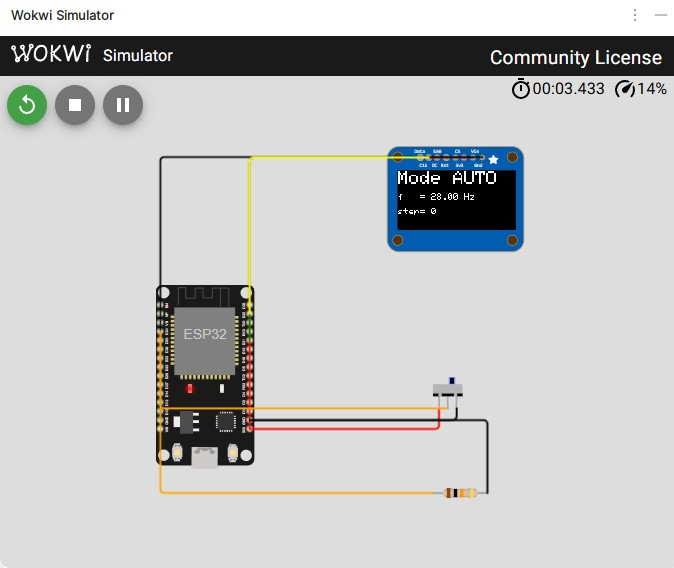

# Stufe 7 — Ausbau (optional)

**Ziel:** Das Projekt komfortabler und vorzeigbar machen.
**Was du lernst:** I²C-Display (SSD1306), ADC am ESP32, Digital-Poti via SPI, Web-Server-Grundlagen.
**Voraussetzung:** [Stufe 6](06-esp32-steuert.md)
**Dauer:** je Ausbau ca. 30–60 Minuten

## Was bauen wir?

Vier **unabhängige Erweiterungen** des Controllers aus Stufe 6. Such dir eine aus — oder mach alle hintereinander. Jede ist für sich alleine umsetzbar, keine hängt zwingend an der anderen:

- **A — OLED-Statusanzeige:** Modus, Ist-Frequenz und Step-Zähler auf einem 0,96"-Display.
- **B — Frequenz-Sollwert per Poti:** Drehknopf an einem ADC-Pin, Soll- und Ist-Wert nebeneinander.
- **C — Frequenz wirklich einstellen:** Digital-Poti als R2, oder der ESP32 ersetzt den 555-Oszillator ganz.
- **D — Web-UI:** Handy oder Laptop im WLAN steuern den Taktgenerator.

Das ist Lehrgeld in kleineren Portionen — der Kern ist fertig, hier kommen die Kür-Elemente.

## Ausbau A — Status-OLED (SSD1306)

Ein 0,96"-OLED über I²C zeigt Modus, aktuelle Frequenz (aus Stufe 5) und den Step-Zähler. Sehr schönes Ergebnis mit minimalem Hardware-Aufwand.

### Schaltung

| OLED | ESP32 |
|------|-------|
| VCC | 3V3 |
| GND | GND |
| SCL | GPIO 22 (I²C-Clock, Default) |
| SDA | GPIO 21 (I²C-Data, Default) |

> **Kollision beachten:** GPIO 21 wird im Stufe-6-Sketch für `LED_SINGLE` genutzt. Wenn OLED + Mode-Controller auf demselben ESP32 laufen, die Single-LED auf einen freien Pin (z. B. **GPIO 23**) umziehen.

### Bibliothek

**Arduino IDE:** Werkzeuge → Bibliotheksverwalter → „Adafruit SSD1306" installieren. Zieht „Adafruit GFX" automatisch mit.

**`arduino-cli` (für den Wokwi-Workflow aus dem [Anhang](anhang-wokwi.md)):**
```
arduino-cli lib install "Adafruit SSD1306"
```
Dasselbe Paket wie in der IDE — `Adafruit GFX Library` und `Adafruit BusIO` kommen als Abhängigkeiten mit. Ohne diesen Schritt scheitert `arduino-cli compile` mit `fatal error: Adafruit_GFX.h: No such file or directory`.

### Code

Grundgerüst mit Frequenzmessung und Platzhalter-Modus: [`code/stage07_oled/stage07_oled.ino`](../code/stage07_oled/stage07_oled.ino). Für den vollen Funktionsumfang den Stufe-6-Code dort einbauen und `modeText` / `stepCount` aus der State-Machine übernehmen.



## Ausbau B — Frequenz-Sollwert per Poti

Ein 10-kΩ-Poti an einem ESP32-ADC-Pin (z. B. **GPIO 35**, nur-Eingang) gibt dir einen „Sollwert" von 0 … 4095 (12-Bit-ADC). Die Ist-Frequenz kommt aus Stufe 5. Auf dem Display: `Soll: 3,0 Hz / Ist: 1,4 Hz`.

Der Soll-Wert ist in dieser Stufe rein **informativ** — er beeinflusst den 555 (noch) nicht. Das ist der Job von Ausbau C.

### ADC-Fallstricke

- ADC2 wird von WiFi mitbenutzt — bei aktivem WLAN **ADC1-Pins** verwenden (GPIO 32–39).
- ADC-Linearität des ESP32 ist mäßig; für Frequenzanzeige völlig ok, für Messtechnik nicht.

## Ausbau C — Frequenz wirklich softwareseitig einstellen

Zwei Wege:

### C.1 Digital-Poti als R2

Ein **MCP41010** (10 kΩ, 8 Bit via SPI) ersetzt R2 im astabilen Zweig. Der ESP32 stellt den Wert per SPI ein, die Frequenz passt sich an.

- Vorteil: der 555 bleibt der Oszillator — originalgetreu zum Tutorial-Thema.
- Nachteil: Wertebereich des Potis begrenzt die Frequenz-Spanne. Für mehr Bereich mehrere C umschaltbar machen (Kondensator-Bank via Transistor-Schalter).

### C.2 Den 555 ersetzen — LEDC (PWM) des ESP32

Der ESP32 hat 16 LEDC-Kanäle mit bis zu 40 MHz. Ein `ledcSetup()` / `ledcWrite()` ersetzt den astabilen 555 komplett.

- Vorteil: beliebige Frequenz, Duty Cycle beliebig, trivial in Software einzustellen.
- Nachteil: **der 555 spielt keine Rolle mehr.** Als bewusster didaktischer Endpunkt ok — „und so geht es ganz ohne Timer-Baustein, wenn man will".

## Ausbau D — Web-UI

Der ESP32 kann WLAN. Mit `WebServer.h` lässt sich eine Mini-HTML-Seite ausliefern, auf der Mode-Buttons und ein Frequenz-Slider liegen. Das Programm ist dann quasi identisch zu Stufe 6, nur mit HTTP-Endpoints statt GPIO-Tastern.

**Skizze:**

```cpp
#include <WiFi.h>
#include <WebServer.h>

WebServer server(80);

void handleHalt()   { applyMode(MODE_HALT);   server.send(200, "text/plain", "HALT"); }
void handleAuto()   { applyMode(MODE_AUTO);   server.send(200, "text/plain", "AUTO"); }
void handleSingle() { applyMode(MODE_SINGLE); server.send(200, "text/plain", "SINGLE"); }
void handleStep()   { if (currentMode == MODE_SINGLE) triggerStep(); server.send(200, "text/plain", "STEP"); }

void setup() {
  // … WiFi.begin(ssid, pass); …
  server.on("/halt",   handleHalt);
  server.on("/auto",   handleAuto);
  server.on("/single", handleSingle);
  server.on("/step",   handleStep);
  server.begin();
}

void loop() {
  server.handleClient();
  // … plus der Code aus Stage 6 / 7 …
}
```

Das HTML kann eine statische Seite im Flash-Dateisystem (SPIFFS/LittleFS) oder ein simples hartkodiertes Template sein. Für den Rahmen dieses Tutorials genügt letzteres.

## Abschluss

Wenn du hier angekommen bist, hast du:

- den **TLC555** in allen drei Grundmodi verstanden und aufgebaut,
- einen **vollständigen Taktgenerator rein in Hardware** gebaut (Stufe 3),
- den **ESP32** zum Beobachter und dann zum Controller gemacht (Stufen 5 und 6),
- optional noch **Display, Poti, Web-UI** ergänzt (Stufe 7).

### Mögliche nächste Projekte

- **CPU-Modell takten:** eine einfache 4-Bit-CPU (Nibbler, SAP-1) braucht genau so einen Taktgenerator mit Auto/Single/Halt.
- **Schrittmotor-Treiber:** Step-Signal aus dem Taktgenerator auf einen A4988.
- **Debounce-Workshop:** vertiefen, wie man Taster in Hardware entprellt (RC + Schmitt-Trigger) und vergleichen mit der Software-Variante aus Stufe 6.
- **Frequenz-Synthesizer:** NCO (Numerically Controlled Oscillator) auf dem ESP32 — der didaktische Gegenentwurf zum 555.

Viel Spaß beim Weitertüfteln.
