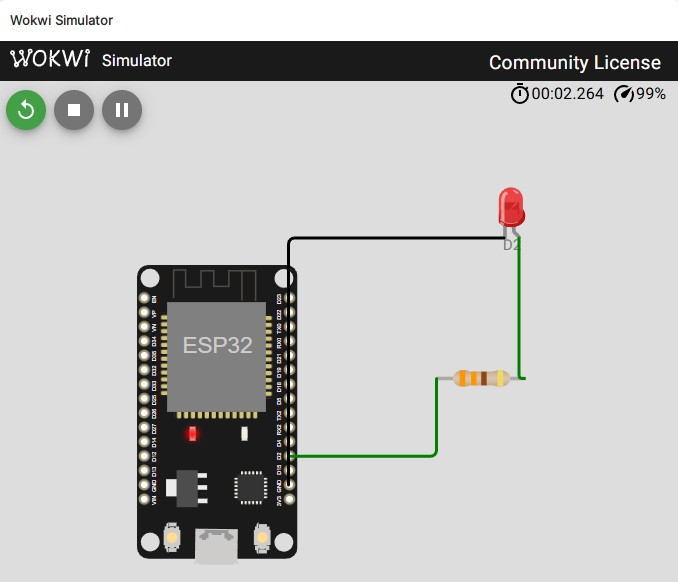

# Anhang — Wokwi-Simulator einrichten

**Ziel:** Die Sketches aus den Stufen 4–7 ohne echten ESP32 am Breadboard in Wokwi simulieren können.
**Was du lernst:** `arduino-cli` als Build-Helfer aufsetzen, Wokwi-Plugin für deinen Editor konfigurieren, eine Simulation mit `diagram.json` + `wokwi.toml` starten.
**Voraussetzung:** [Stufe 4](04-esp32-einstieg.md) gelesen (Grundverständnis der Toolchain). Ein Editor deiner Wahl: **VS Code** oder **IntelliJ IDEA / CLion**.
**Dauer:** ca. 20 Minuten für die erstmalige Einrichtung.

## Was ist Wokwi?

[Wokwi](https://wokwi.com) ist ein browserbasierter ESP32-Simulator mit einem virtuellen Breadboard. Der gleiche Hersteller bietet Plugins für VS Code und IntelliJ, mit denen du die Simulation lokal neben deinem Code laufen lässt.

Wann lohnt sich Wokwi?

- Wenn du einen Sketch unterwegs testen willst, ohne den Koffer mit Breadboard dabei zu haben.
- Für eine schnelle Plausibilitätsprüfung vor dem physischen Aufbau.
- Um einen Sketch jemandem zu zeigen, ohne dass er erst Hardware zusammenstecken muss.

Wokwi **ersetzt nicht** den realen Aufbau. Timing-Toleranzen, Kontaktprobleme, Versorgungsrauschen und die Eigenheiten eines echten 555 (der kein idealer Baustein ist) siehst du nur am echten Steckbrett. Nimm Wokwi als Beschleuniger, nicht als Ersatz.

## Was bauen wir?

Am Ende dieses Anhangs läuft Sketch `stage04_blink` in deinem Editor — virtuelles Board auf dem Bildschirm, blinkende LED im Sekundentakt, kompiliert aus deinem Quellcode. Die übrigen Sketches (`stage04_button` bis `stage07_oled`) startest du danach mit derselben Prozedur.

## Schritt 1 — `arduino-cli` installieren

Das Wokwi-Plugin braucht die kompilierte Firmware als `.bin` und `.elf`. Die Arduino IDE 2.x kann das zwar per *Sketch → Export Compiled Binary* erzeugen, aber `arduino-cli` ist bequemer, weil die Ausgabedateien klare Namen in einem festen `build/`-Ordner bekommen — genau dort, wo unsere `wokwi.toml` sie sucht.

1. `arduino-cli` holen: [arduino.github.io/arduino-cli](https://arduino.github.io/arduino-cli/latest/installation/) — Windows-Zip entpacken und den Ordner in die PATH-Umgebungsvariable aufnehmen. Alternativ per [Scoop](https://scoop.sh): `scoop install arduino-cli`.
2. Installation prüfen:
   ```
   arduino-cli version
   ```
3. Einmalig den ESP32-Core installieren:
   ```
   arduino-cli core install esp32:esp32
   ```
4. Für Stufe 7 (OLED) zusätzlich die Adafruit-Libraries — `arduino-cli` installiert sie nicht automatisch, anders als die Arduino IDE über den Bibliotheksverwalter:
   ```
   arduino-cli lib install "Adafruit SSD1306"
   ```
   Das zieht `Adafruit GFX Library` und `Adafruit BusIO` als Abhängigkeiten mit. Prüfen mit `arduino-cli lib list`.
5. Im jeweiligen Sketch-Ordner kompilieren, z.B.:
   ```
   cd code/stage04_blink
   arduino-cli compile --fqbn esp32:esp32:esp32doit-devkit-v1 --output-dir build
   ```

> **Checkpoint:** In `code/stage04_blink/build/` liegen jetzt u.a. `stage04_blink.ino.bin` und `stage04_blink.ino.elf`. Wenn ja: Kompiler-Pipeline läuft.

Die Arduino IDE selbst bleibt weiter nutzbar — sie und `arduino-cli` teilen sich intern denselben Kern. Für Upload auf echte Hardware ist die IDE weiterhin der einfachste Weg; `arduino-cli` brauchen wir nur für Wokwi.

## Schritt 2 — Wokwi-Plugin installieren

Beide Plugins sind kostenlos, beide verlangen aber einen einmaligen Login mit einem kostenlosen Wokwi-Account.

### Option A — Visual Studio Code

1. Extension „Wokwi Simulator" (Herausgeber: Wokwi) aus dem Marketplace installieren.
2. Beim ersten Start einmal durch den Login-Flow klicken.
3. In VS Code den **Sketch-Ordner** öffnen (z.B. `File → Open Folder → code/stage04_blink/`). Das Plugin sucht `wokwi.toml` im geöffneten Ordner.
4. Simulation starten: Command Palette (`Ctrl+Shift+P`) → *Wokwi: Start Simulator*.

### Option B — IntelliJ IDEA / CLion

1. Plugin „Wokwi Simulator" aus dem JetBrains-Marketplace installieren.
2. Beim ersten Start einmal durch den Login-Flow klicken.
3. Das **Projekt-Root** ist üblicherweise `ESP32-NE555-Tutorial` (öffnest du in *File → Open*). Das Plugin löst Pfade relativ zu diesem Root auf.
4. **Run → Edit Configurations → + → Wokwi Simulator**. Feld *Configuration File* auf die `wokwi.toml` des gewünschten Sketches setzen:
   ```
   code/stage04_blink/wokwi.toml
   ```

> **Wichtig — Slash-Gotcha unter Windows:** Im Feld *Configuration File* **Forward-Slashes** `/` verwenden, keine Backslashes `\`. Windows zeigt Pfade zwar mit `\`, das Plugin interpretiert sie aber nicht als Pfadtrenner. Symptom bei falschem Pfad: `Configuration file ... not found in project`, obwohl die Datei existiert.

> **Checkpoint:** Run-Configuration starten. Das virtuelle Board erscheint, nach wenigen Sekunden blinkt die externe rote LED (angeschlossen an D2) im Sekundentakt.



## Die zwei Wokwi-Dateien pro Sketch

Jeder Sketch in `code/stageXX_*/` hat zwei Wokwi-Dateien, die vorkonfiguriert im Repo liegen:

- **`diagram.json`** — das virtuelle Breadboard: welche Bauteile, welche Verdrahtung, Startwerte der Komponenten. Du kannst die Datei auf [wokwi.com](https://wokwi.com) auch visuell im Browser bearbeiten und dann hierher kopieren.
- **`wokwi.toml`** — sagt dem Plugin, wo die Firmware liegt. Die Default-Pfade `build/<sketch>.ino.bin` und `build/<sketch>.ino.elf` passen genau zu dem `arduino-cli compile --output-dir build` aus Schritt 1.

## Die Sketches nacheinander simulieren

Kompilier- und Simulations-Zyklus ist für jeden Sketch identisch:

1. `cd code/stageXX_*`
2. `arduino-cli compile --fqbn esp32:esp32:esp32doit-devkit-v1 --output-dir build`
3. In deinem Editor den Sketch öffnen bzw. die Run-Config auf diesen `wokwi.toml` setzen.
4. Simulation starten.

Besonderheiten der einzelnen Stufen im Sim:

| Stufe | Pulsquelle | Interaktion |
|-------|-----------|-------------|
| `stage04_blink` | keine | — |
| `stage04_button` | — | auf den Taster im Sim klicken |
| `stage05_freqmeter` | Slide-Switch als manueller 555-Ersatz (siehe Kasten) | Schiebeschalter mehrfach hin-und-her → ISR zählt Flanken |
| `stage06_controller` | — | vier Taster anklicken; **Wokwi zeigt nur die MCU-Steuersignale, nicht die resultierende 555-Ausgabe** (kein Blinken im AUTO, kein Ausgangspuls im SINGLE) |
| `stage07_oled` | Slide-Switch als manueller 555-Ersatz | Display zeigt Mode / Frequenz / Step-Count |

> **Warum kein 555 im Wokwi?** Wokwi hat keinen NE555 in der Bauteil-Bibliothek. In den Stufen 5 und 7 ersetzen wir ihn daher durch einen **Slide-Switch** (Pin 2 an GPIO 34, Pin 1 an 3V3, Pin 3 an GND, plus 10-kΩ-Pull-down). Jede Schiebebewegung erzeugt eine Flanke — du testest damit den ESP32-Code, nicht das 555-Verhalten. **Für echtes Frequenz-Timing brauchst du den Hardware-Aufbau oder eine 555-fähige Simulation wie [Falstad](https://www.falstad.com/circuit/).**

## Troubleshooting

| Symptom | Ursache / Abhilfe |
|---------|-------------------|
| `Configuration file ... not found in project` (IntelliJ) | Run-Config-Pfad enthält Backslashes → durch Forward-Slashes ersetzen. |
| `fatal error: Adafruit_GFX.h: No such file or directory` (oder andere Header) | Bibliothek in `arduino-cli` fehlt. Fix: `arduino-cli lib install "Adafruit SSD1306"` (zieht GFX + BusIO mit). |
| `Firmware not found` / `ELF not found` | Sketch noch nicht kompiliert oder `--output-dir build` vergessen. |
| Simulation startet, aber LED bewegt sich nicht | Im `diagram.json` falscher Board-Typ. Unsere Sketches brauchen `board-esp32-devkit-v1` (klassischer ESP32, nicht S3). |
| Plugin meldet „unknown pin" oder Bauteil wirkt **unverdrahtet** | Pin-Name stimmt nicht mit Wokwis Schema überein — Wokwi lässt die Verbindung dann still fallen. Korrekt: ESP32-GPIOs mit `D`-Prefix (`D2`, `D32`, …), SSD1306 verwendet `VIN` / `GND` / `DATA` / `CLK` (nicht `VCC` / `SDA` / `SCL`). |
| Bauteil-Typ nicht gefunden (z.B. `wokwi-ne555`) | Der Part existiert nicht in Wokwis Bibliothek. Für den 555 gibt es keinen Baustein — ersetzen durch `wokwi-slide-switch` o.ä. (siehe Kasten oben). |
| Sim lädt, bricht sofort ab („license expired") | Wokwi-Account-Token abgelaufen → erneut einloggen. |

## Rückblick

Was du jetzt kannst:

- Einen Arduino-Sketch **per Kommandozeile** für den ESP32 kompilieren (`arduino-cli compile ... --output-dir build`).
- Das Wokwi-Plugin in VS Code **oder** IntelliJ einrichten und eine Simulation starten.
- Zwischen `diagram.json` (Schaltung) und `wokwi.toml` (Firmware-Pfade) unterscheiden.
- Die häufigsten Plugin-Fehler selbst einordnen — inklusive der tückischen Windows-Backslashes.

## Rückbezug zu den Stufen

Ab [Stufe 4](04-esp32-einstieg.md) ist Wokwi als Alternative zum realen Steckbrett nutzbar. Der empfohlene Weg bleibt: **zuerst real bauen, dann in Wokwi variieren**. Aber wenn gerade keine Hardware zur Hand ist, ersetzt Wokwi den Steckplatz bis zum nächsten Werkstattabend.
